<!-- _class: titre -->

# Régression Linéaire & Descente de Gradient

### Formation ML — Séance 2

 

**30 septembre 2026**

---

## Rappel — Séance 1

- Le ML apprend des **règles à partir de données**
- On a des **features** et une **target**
- On distingue **paramètres** et **hyperparamètres**

**Intuition —** On avait observé un lien entre revenu médian et prix du logement — et on s'était demandé comment tracer, <b>de façon systématique</b>, la droite qui représente le mieux cette relation.

---

<!-- _class: section -->

# La structure de tout algorithme d'apprentissage

---

## Trois briques, toujours les mêmes

①

<b>Le modèle</b> 
une fonction qui prédit

→

②

<b>La fonction de coût</b> 
mesure l'erreur

→

③

<b>L'optimisation</b> 
ajuste les paramètres

**À retenir —** Cette structure en 3 briques revient à <b>chaque séance</b> du module — seul leur contenu change. Aujourd'hui, on la construit en détail sur un premier cas : la régression linéaire.

---

## Ce que ça donne aujourd'hui

| Brique | Aujourd'hui |
|---|---|
| ① Modèle | $\hat{y} = wx + b$ (une droite) |
| ② Fonction de coût | MSE — l'erreur quadratique moyenne |
| ③ Optimisation | Équations normales **ou** descente de gradient |

---

<!-- _class: section -->

# ① Le modèle

---

## Une droite, deux paramètres

$$\hat{y} = w \cdot x + b$$

| Symbole | Nom | Rôle |
|---|---|---|
| $w$ | **poids** | la pente de la droite |
| $b$ | **biais** | l'ordonnée à l'origine |
| $\hat{y}$ | **prédiction** | à distinguer de $y$, la vraie valeur |

$w$ et $b$ sont les <b>paramètres</b> du modèle — exactement ceux que l'entraînement va ajuster automatiquement.

---

## Une droite au hasard vs. la droite optimale

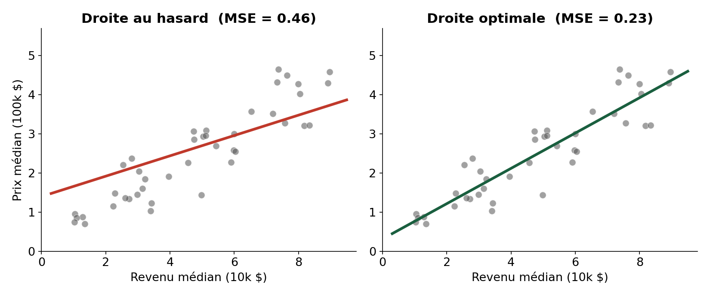

**Attention —** Une droite au hasard n'est pas absurde, mais clairement sous-optimale — l'erreur (MSE) est 2 fois plus élevée. Comment trouver <b>automatiquement</b> la meilleure ?

---

## Un détour statistique : la corrélation

Avant de chercher <i>comment</i> trouver la meilleure droite, demandons-nous <i>pourquoi</i> une droite a du sens ici. La statistique répond avec le <b>coefficient de corrélation linéaire</b> — il mesure la force du lien linéaire entre deux variables.

$$r_{xy} = \frac{s_{xy}}{s_x \, s_y} \qquad s_{xy} = \text{covariance}(x, y)$$

- $r_{xy}$ est toujours compris entre $-1$ et $1$
- Proche de $\pm 1$ → lien linéaire fort · proche de $0$ → lien linéaire faible ou absent
- Le signe indique le sens de la relation (croissante ou décroissante)

---

## Le coefficient de corrélation, en images

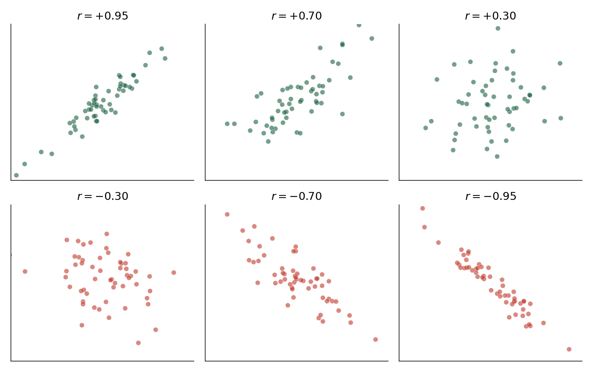

**À retenir —** Plus les points sont alignés, plus $|r_{xy}|$ est proche de 1. Sur California Housing, `MedInc` et `MedHouseVal` ont $r_{xy} \approx 0.69$ — un lien réel, mais loin d'être parfait, d'où le nuage qu'on observe.

---

## Le coefficient de corrélation n'est valide que sous conditions

- **Normalité** — le couple $(X, Y)$ doit suivre (approximativement) une loi normale à deux dimensions
- **Homoscédasticité** — la variance de $Y$ ne dépend pas de $X$ (pas d'effet "entonnoir" dans le nuage)
- **Linéarité** — $r_{xy}$ ne mesure qu'un lien **linéaire** : une relation forte mais courbe peut donner $r_{xy} \approx 0$

**Attention —** Toujours **regarder le nuage de points**, pas seulement le chiffre — $r_{xy}$ seul peut tromper si une de ces conditions n'est pas respectée.

---

<!-- _class: section -->

# ② La fonction de coût

---

## Où on en est dans le pipeline

Données (features + target)

→

① Modèle produit ŷ

→

<b>② Fonction de coût</b> compare ŷ et y

**Intuition —** On est ici : le modèle produit déjà des prédictions (même mauvaises). La fonction de coût sert à <b>chiffrer à quel point elles sont mauvaises</b> — c'est le signal que l'optimisation (brique ③) utilisera ensuite pour corriger le modèle.

---

## Partons de vraies données

Prenons 5 districts réels de California Housing, et une droite déjà tracée ($w \approx 0.42$, $b \approx 0.45$) :

| MedInc ($x$) | MedHouseVal ($y$) | $\hat{y}$ (prédiction) | erreur ($y - \hat{y}$) |
|---|---|---|---|
| 3.46 | 2.39 | 1.90 | +0.49 |
| 2.94 | 2.33 | 1.68 | +0.65 |
| 2.56 | 1.56 | 1.52 | +0.04 |
| 2.00 | 0.91 | 1.29 | −0.38 |
| 4.81 | 1.61 | 2.46 | −0.85 |

**Attention —** Certaines erreurs sont positives, d'autres négatives. Une simple moyenne des erreurs donnerait <code>(0.49 + 0.65 + 0.04 − 0.38 − 0.85) / 5 ≈ −0.01</code> — proche de zéro, alors que le modèle se trompe clairement sur chaque ligne !

---

## D'où l'idée d'élever au carré

| erreur | erreur² |
|---|---|
| +0.49 | 0.24 |
| +0.65 | 0.42 |
| +0.04 | 0.00 |
| −0.38 | 0.14 |
| −0.85 | 0.72 |

$$\text{Moyenne des erreurs}^2 = \frac{0.24 + 0.42 + 0.00 + 0.14 + 0.72}{5} = 0.304$$

**À retenir —** Cette fois, plus aucune annulation possible — chaque erreur, positive ou négative, contribue <b>positivement</b> au total. C'est exactement la définition de la MSE.

---

## L'erreur quadratique moyenne (MSE), formalisée

$$\text{MSE}(w, b) = \frac{1}{n} \sum_{i=1}^{n} \left( y_i - (w x_i + b) \right)^2$$

C'est exactement le calcul qu'on vient de faire à la main sur 5 lignes — généralisé aux $n$ lignes du dataset entier. La MSE est une fonction de $w$ et $b$ (<b>pas</b> de $x$) : pour chaque couple $(w, b)$, elle donne un seul chiffre.

---

## Les caractéristiques d'une bonne fonction de coût

| Propriété | Pourquoi c'est important |
|---|---|
| **Toujours positive ou nulle** | Pas d'annulation entre erreurs positives/négatives |
| **Nulle seulement si prédiction parfaite** | Sert de "zéro" de référence |
| **Dérivable** | Indispensable pour la descente de gradient (brique ③) |
| **Pénalise davantage les grosses erreurs** | Une erreur énorme doit plus alerter qu'une petite |

**À retenir —** La MSE coche ces 4 cases — c'est pour ça qu'elle est le choix par défaut en régression, pas par hasard.

---

## Visualiser la fonction de coût

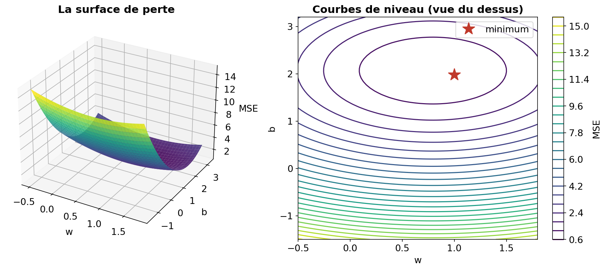

**À retenir —** La MSE d'un modèle linéaire est <b>convexe</b> — un seul minimum (l'étoile), pas de fausses vallées où rester coincé.

---

<!-- _class: section -->

# La MSE n'est pas la seule option

---

## D'autres fonctions de coût existent

**Intuition —** Chaque étape du pipeline a plusieurs choix possibles — le modèle peut être linéaire ou non, et de la même façon, <b>la fonction de coût dépend du problème</b>. La MSE est le choix classique en régression, mais pas le seul.

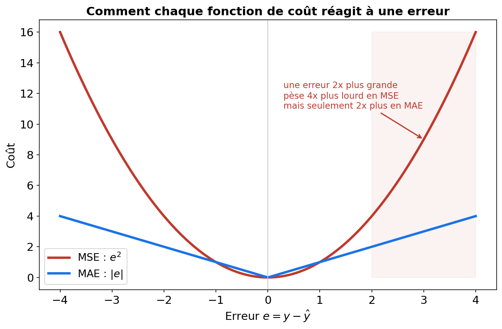

---

## MSE vs MAE — un vrai compromis

| | **MSE** (erreur quadratique) | **MAE** (erreur absolue) |
|---|---|---|
| Formule | $\frac{1}{n}\sum (y_i - \hat{y}_i)^2$ | $\frac{1}{n}\sum \lvert y_i - \hat{y}_i \rvert$ |
| Grosses erreurs | Fortement pénalisées | Pénalisées proportionnellement |
| Sensibilité aux outliers | **Élevée** | **Faible** (plus robuste) |
| Dérivable partout | Oui | Non (point anguleux en 0) |

**Attention —** Cette différence n'est pas théorique — elle change concrètement la droite obtenue dès qu'il y a des données aberrantes.

---

## La différence en pratique : un seul outlier

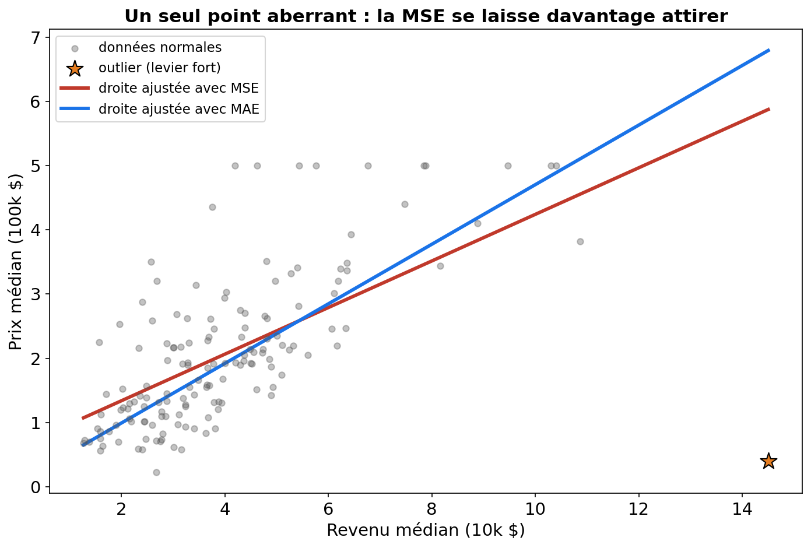

**À retenir —** Le point aberrant "tire" davantage la droite ajustée avec MSE (il pèse au carré dans le calcul) que celle ajustée avec MAE. Ce choix de fonction de coût est donc une vraie décision de modélisation, pas un détail technique.

---

## Un aperçu du paysage complet

| Type de problème | Fonctions de coût courantes |
|---|---|
| **Régression** | MSE, MAE, Huber (compromis des deux) |
| **Classification** (→ Séance 3) | Log-loss / entropie croisée |
| Autres (hors module) | Hinge loss (SVM), etc. |

**À retenir —** On garde la MSE pour la suite de cette séance — plus simple, différentiable partout, standard. Mais retenir <b>le principe</b> : choisir une fonction de coût, c'est choisir ce que le modèle considère comme "grave".

---

<!-- _class: section -->

# ③ L'optimisation — première approche : une solution directe

---

## Le point de départ : le minimum a une pente nulle

**Rappel —** de calcul différentiel : <b>au minimum d'une fonction dérivable, sa pente (dérivée) vaut zéro</b> — la tangente y est plate. C'est vrai pour $w$ <b>et</b> pour $b$ simultanément.

Au lieu d'avancer pas à pas vers ce point plat (ce que fera la descente de gradient), une autre idée : **poser directement** que les deux pentes valent zéro, et résoudre.

$$\frac{\partial \text{MSE}}{\partial w} = 0 \qquad \text{et} \qquad \frac{\partial \text{MSE}}{\partial b} = 0$$

C'est un système de 2 équations, à 2 inconnues ($w$ et $b$) — donc résoluble directement.

---

## La solution, pour une seule feature : la statistique suffit

En résolvant $\partial\text{MSE}/\partial w = 0$ et $\partial\text{MSE}/\partial b = 0$ pour **une** feature, les deux inconnues s'isolent en deux quantités déjà connues — la covariance et la variance :

$$\hat{w} = \frac{\sum_i (x_i - \bar{x})(y_i - \bar{y})}{\sum_i (x_i - \bar{x})^2} = \frac{s_{xy}}{s_x^2} \qquad\qquad \hat{b} = \bar{y} - \hat{w}\,\bar{x}$$

**À retenir —** Et le lien avec la corrélation vue plus haut : $\hat{w} = r_{xy} \dfrac{s_y}{s_x}$. Pas besoin de matrices pour une seule feature — la statistique descriptive suffit entièrement.

---

## Le même exemple à la main, par la statistique

4 points : $(x, y) = (1, 2.1), (2, 3.9), (3, 6.2), (4, 7.8)$

$$\bar{x} = 2.5 \qquad \bar{y} = 5.0$$

$$s_{xy} = \sum (x_i-\bar{x})(y_i-\bar{y}) = 9.7 \qquad\qquad s_x^2 = \sum (x_i-\bar{x})^2 = 5.0$$

$$\hat{w} = \frac{9.7}{5.0} = 1.94 \qquad\qquad \hat{b} = 5.0 - 1.94 \times 2.5 = 0.15$$

**À retenir —** La droite $\hat{y} = 1.94x + 0.15$ minimise exactement la MSE sur ces 4 points — obtenue avec une moyenne, une covariance, une variance. Zéro itération, zéro learning rate, zéro matrice.

---

## Et avec plusieurs features ? La généralisation matricielle

Dès qu'on a $p > 1$ features, il n'existe plus de formule aussi simple — mais le **même principe** (gradient = 0) se généralise avec l'écriture matricielle : $X$ la matrice des features (+ une colonne de 1 pour le biais), $\boldsymbol{\theta} = (b, w_1, \dots, w_p)$.

$$\text{MSE}(\boldsymbol{\theta}) = \frac{1}{n} \lVert y - X\boldsymbol{\theta} \rVert^2 \;\Longrightarrow\; X^T X \, \boldsymbol{\theta} = X^T y \;\Longrightarrow\; \boldsymbol{\theta}^* = (X^T X)^{-1} X^T y$$

C'est exactement le même calcul que la statistique vient de faire à la main pour 1 feature — juste écrit pour $p$ dimensions à la fois. Les matrices ne sont pas une méthode différente, seulement une façon de ne pas réécrire $p$ fois la même formule.

---

## Vérification : les deux méthodes donnent le même résultat

Sur les 4 mêmes points ($X$ avec une colonne de 1, et $\boldsymbol{\theta} = (b, w)$) :

$$X^T X = \begin{bmatrix} 4 & 10 \\ 10 & 30 \end{bmatrix} \qquad X^T y = \begin{bmatrix} 20.0 \\ 59.7 \end{bmatrix} \qquad (X^T X)^{-1} = \begin{bmatrix} 1.5 & -0.5 \\ -0.5 & 0.2 \end{bmatrix}$$

$$\boldsymbol{\theta}^* = (X^T X)^{-1} X^T y = \begin{bmatrix} 0.15 \\ 1.94 \end{bmatrix}$$

**À retenir —** Exactement les mêmes $b = 0.15$ et $w = 1.94$ qu'avec la statistique. La matrice n'est qu'une généralisation du même calcul — pas une méthode alternative.

---

## L'intuition géométrique de la version matricielle

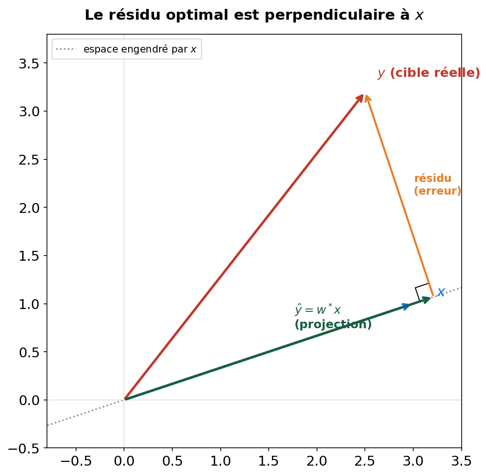

$\hat{y}$ est la <b>projection orthogonale</b> de $y$ sur l'espace engendré par les colonnes de $X$ — le point de cet espace le plus proche possible de $y$. Le résidu est alors forcément <b>perpendiculaire</b> à cet espace : $X^T(y - X\theta) = 0$.

---

## Une méthode exacte, mais pas gratuite

| | Équations normales | Descente de gradient |
|---|---|---|
| Résultat | Exact, en une fois | Approché, itératif |
| Coût de calcul | $O(np^2 + p^3)$ (construire puis inverser $X^TX$) | $O(np)$ par itération |
| Beaucoup de features ($p$ grand) | **Devient très cher** | Reste praticable |
| Réglages à faire | Aucun | Learning rate, nb d'itérations |

**Attention —** Avec $p = 8$ features (California Housing), inverser $X^TX$ ne coûte rien. Avec $p = 100\,000$ (texte, images...), c'est <b>totalement impraticable</b> — c'est précisément là que la descente de gradient devient indispensable, pas juste une alternative académique.

---

<!-- _class: section -->

# ③ L'optimisation — deuxième approche : la descente de gradient

---

## Repartir de la dérivée

Tu connais déjà la dérivée : c'est la <b>pente de la tangente</b> à une courbe en un point. Une pente positive = la courbe monte à cet endroit. Une pente négative = elle descend.

**L'idée de la descente de gradient : utiliser cette pente pour savoir de quel côté avancer.**

Pour construire l'intuition, on se limite d'abord à **un seul paramètre** ($w$, en fixant $b$ à sa valeur optimale) — on généralisera aux deux ensuite.

---

## La pente nous dit où aller

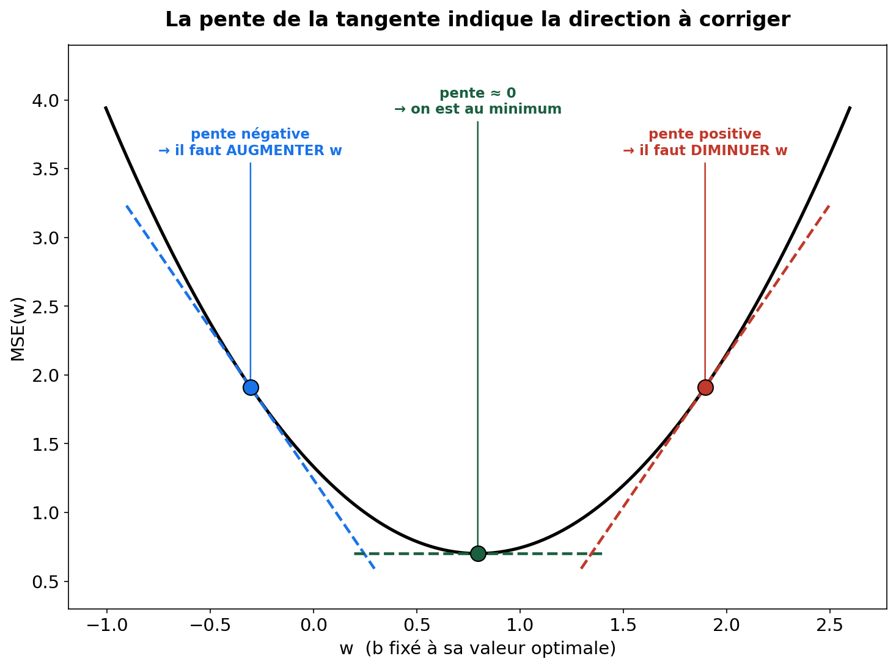

**À retenir —** À gauche du minimum, la pente est négative → il faut <b>augmenter</b> $w$. À droite, elle est positive → il faut le <b>diminuer</b>. Au minimum, la pente est nulle : on ne bouge plus.

---

## Pourquoi suivre la tangente fonctionne

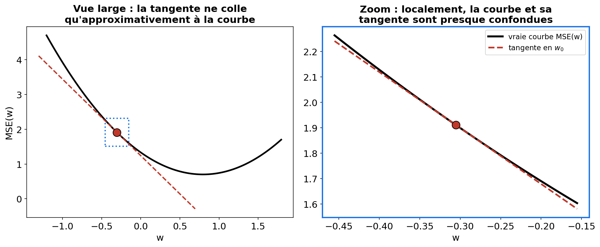

Une courbe dérivable ressemble de très près à sa tangente, <b>tant qu'on reste proche</b> du point de contact. Suivre la pente de la tangente fait donc bien baisser la <i>vraie</i> courbe — à condition de ne pas s'éloigner trop vite (d'où l'importance du learning rate, qu'on voit juste après).

---

## La règle : avancer dans le sens opposé à la pente

$$w \leftarrow w - \alpha \cdot \text{pente}$$

- Pente négative → on **soustrait un nombre négatif** → $w$ **augmente** ✓
- Pente positive → on **soustrait un nombre positif** → $w$ **diminue** ✓
- $\alpha$ (le **learning rate**) contrôle la taille du pas

**À retenir —** Dans les deux cas, on se rapproche du minimum. C'est le même réflexe, qu'on soit à gauche ou à droite.

---

## Itérer : un pas, puis un autre, puis un autre...

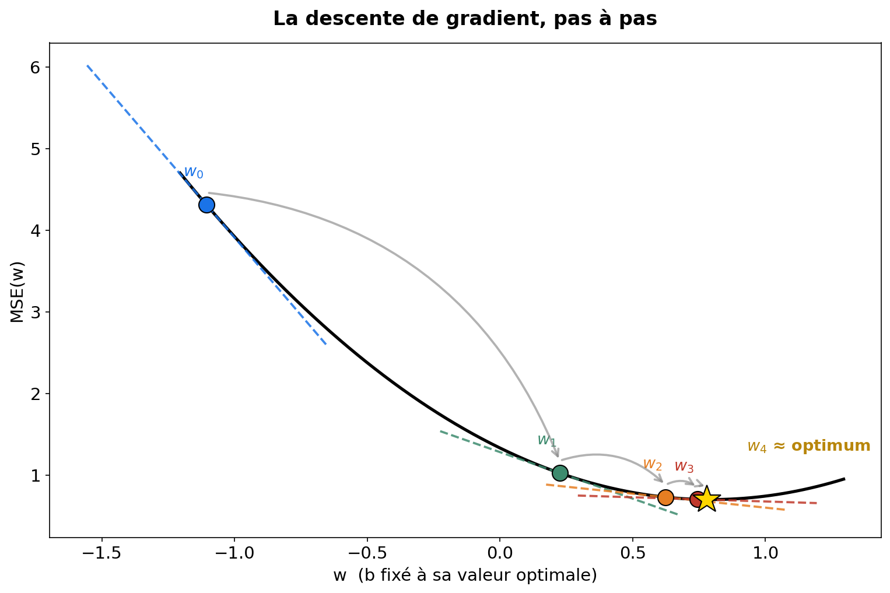

Chaque tangente donne une nouvelle direction, on avance, on recalcule la pente à l'endroit où on est arrivé, on ré-avance... Les premiers pas sont grands (pente forte, loin du minimum), les derniers sont petits (pente faible, proche du minimum) — la convergence <b>ralentit naturellement</b> à l'approche de la solution.

---

<!-- _class: section -->

# Généraliser à deux paramètres

---

## De la pente au gradient

Avec deux paramètres ($w$ et $b$), une seule pente ne suffit plus : il faut savoir dans quelle direction du plan $(w, b)$ avancer.

$$\frac{\partial \text{MSE}}{\partial w} = -\frac{2}{n} \sum_{i=1}^{n} x_i \left( y_i - \hat{y}_i \right)$$

$$\frac{\partial \text{MSE}}{\partial b} = -\frac{2}{n} \sum_{i=1}^{n} \left( y_i - \hat{y}_i \right)$$

Le <b>gradient</b> est simplement la paire de ces deux pentes — une par paramètre. Il pointe dans la direction où la MSE <b>augmente</b> le plus vite.

---

## Le champ de gradients

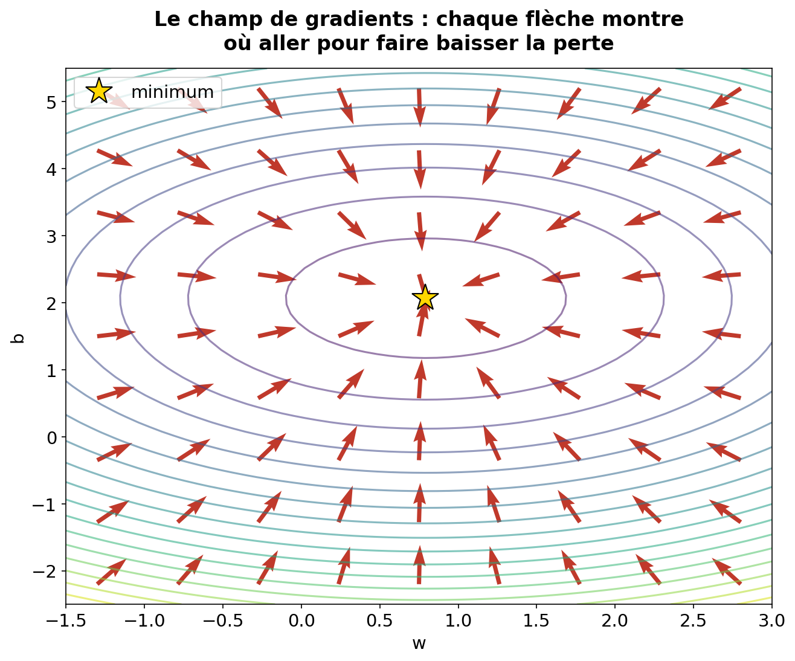

**À retenir —** Chaque flèche montre la direction de <b>descente</b> (l'opposé du gradient) à cet endroit précis. Où qu'on démarre sur cette carte, suivre les flèches ramène vers le centre — exactement le même principe qu'en 1D, juste avec deux directions à corriger en même temps.

---

## La règle de mise à jour, généralisée

$$w \leftarrow w - \alpha \frac{\partial \text{MSE}}{\partial w}$$

$$b \leftarrow b - \alpha \frac{\partial \text{MSE}}{\partial b}$$

- On avance dans la direction **opposée** au gradient (on veut descendre)
- $\alpha$ = le **learning rate** : la taille de chaque pas
- Les deux paramètres se mettent à jour **simultanément**, à chaque itération

---

## La droite qui se corrige, itération par itération

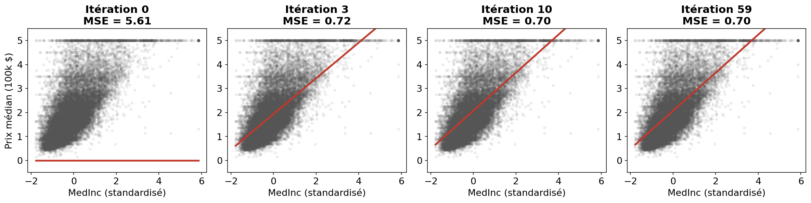

**À retenir —** On part d'une droite plate (MSE = 5.61) et en une dizaine d'itérations à peine, on converge quasiment vers l'optimum (MSE = 0.70).

---

<!-- _class: section -->

# Le rôle du learning rate

---

## Deux trajectoires, deux destins

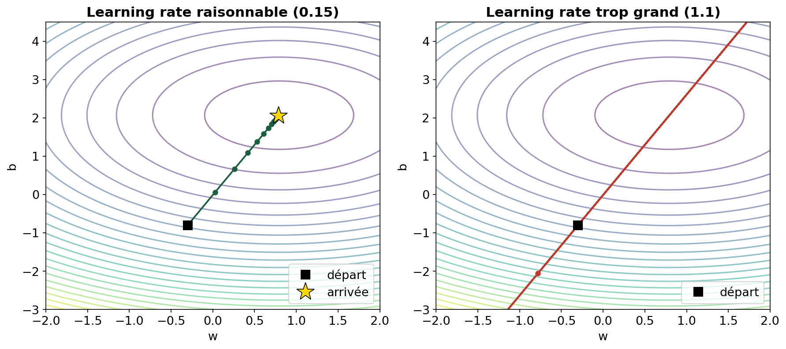

**Attention —** À gauche : on descend proprement vers le centre. À droite : chaque pas est si grand qu'on <b>s'échappe</b> du bol au lieu de s'en approcher — la perte explose au lieu de diminuer.

---

## Quatre learning rates, quatre comportements

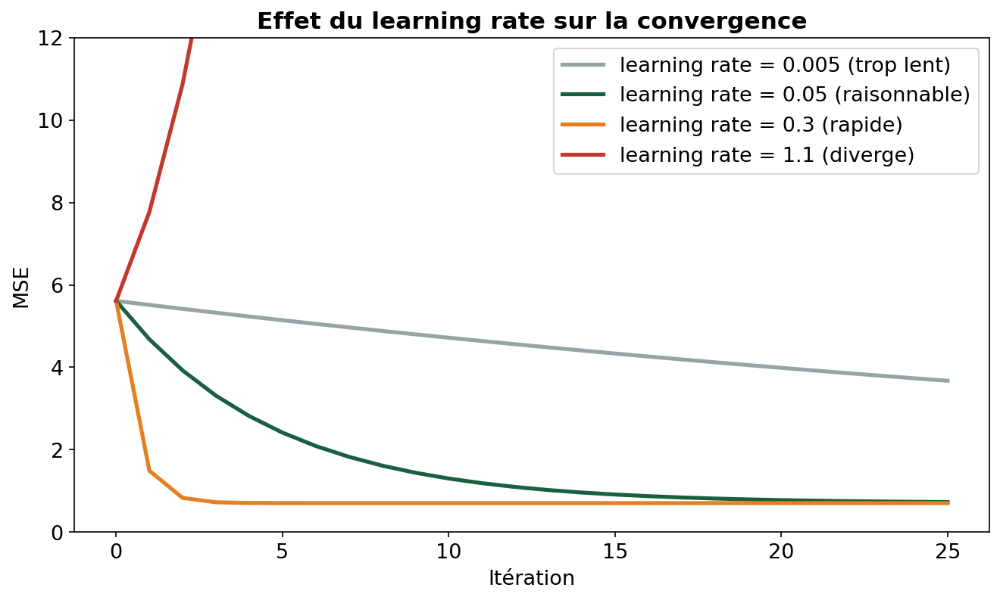

---

## Ce qu'il faut en retenir

| Learning rate | Comportement |
|---|---|
| **Trop petit** (0.005) | Converge, mais beaucoup trop lentement |
| **Bien choisi** (0.05 - 0.3) | Convergence rapide et stable |
| **Trop grand** (1.1) | Diverge — la perte explose |

**Attention —** Sans <b>standardisation</b> des features au préalable, un seul learning rate ne peut pas convenir à des variables d'échelles très différentes (ex : <code>Population</code> en milliers vs <code>MedInc</code> en dizaines) — la convergence devient instable ou très lente.

---

<!-- _class: section -->

# Généraliser à plusieurs features

---

## De 1 à $p$ features

$$\hat{y} = w_1 x_1 + w_2 x_2 + \dots + w_p x_p + b = \mathbf{w}^T \mathbf{x} + b$$

Le principe (①②③) reste <b>exactement le même</b> — seule la dimension change. C'est là que la formulation matricielle prend tout son sens : le code ne change presque pas.

---

## En pratique : scikit-learn

| Classe | Méthode |
|---|---|
| `LinearRegression` | résout le même problème par une méthode plus stable (SVD), sans jamais former $X^TX$ |
| `SGDRegressor` | descente de gradient **stochastique** (un exemple à la fois — pas le full-batch codé plus haut) |

**Attention —** On sépare toujours <b>train</b> et <b>test</b> avant de standardiser — <code>fit_transform</code> sur le train, <code>transform</code> (sans re-fit) sur le test. Réutiliser les statistiques du train évite une fuite d'information (<i>data leakage</i>).

---

<!-- _class: section -->

# Débrief

---

## Ce qu'on retient

① <b>Modèle</b> ŷ = wx+b

→

② <b>Coût</b> MSE

→

③ <b>Optimisation</b> gradient descent

**À retenir —** Cette structure ①②③ revient en Séance 3 — même brique ③ (gradient descent), mais avec un modèle et une fonction de coût différents pour la classification.

**→ Séance 3 : classification & régression logistique**

---

<!-- _class: titre -->

# Merci !

### Questions ?

Canal WhatsApp — questions ML
