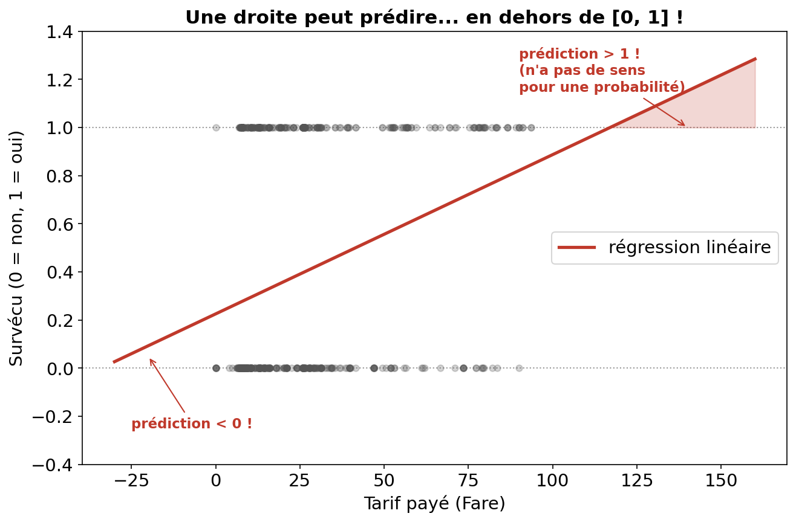
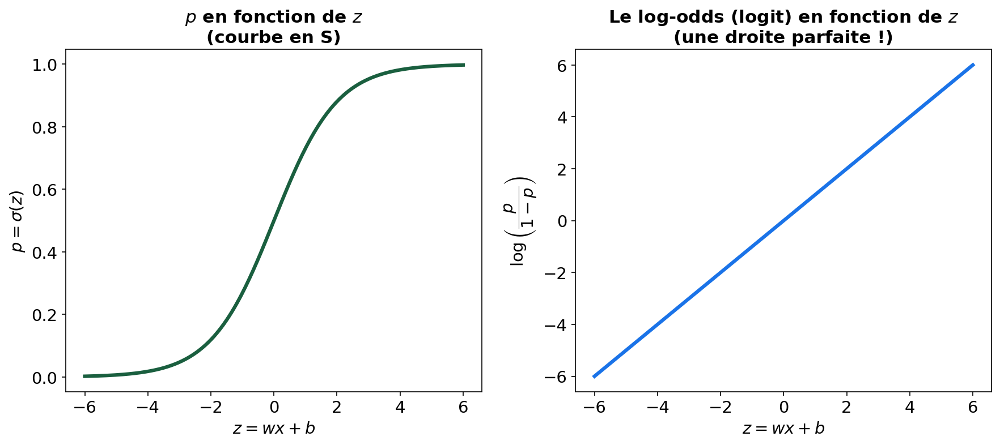
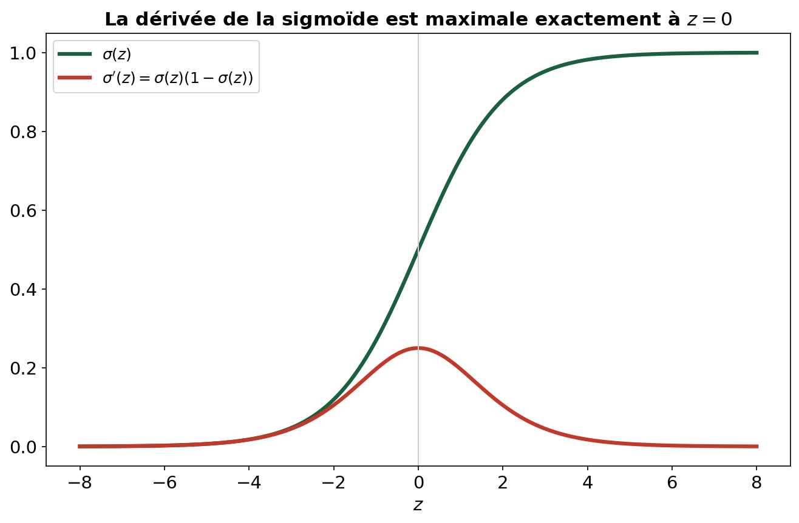
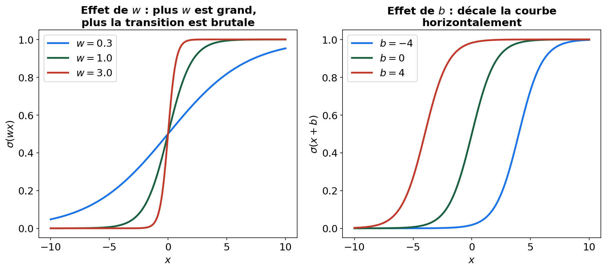
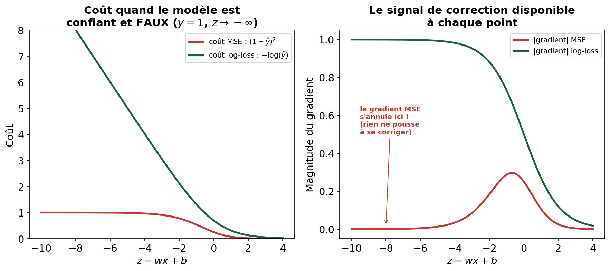
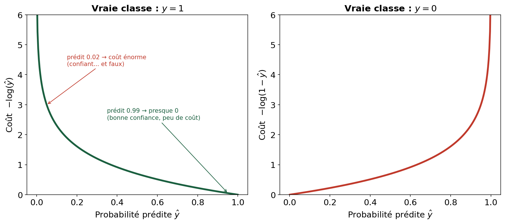
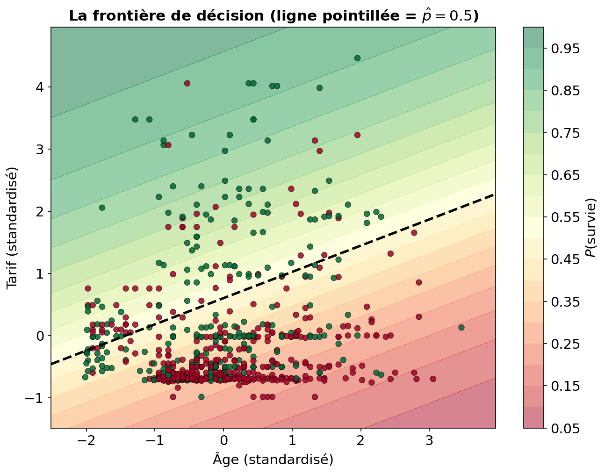

<!-- _class: titre -->

# Classification & Régression Logistique

### Formation ML — Séance 3

 

**3 octobre 2026**

---

## Rappel — Séance 2

- Un algorithme d'apprentissage a toujours 3 briques : ① modèle, ② fonction de coût, ③ optimisation
- On a construit une régression pour prédire une valeur **continue**
- La descente de gradient suit la pente pour minimiser le coût

**Intuition —** Aujourd'hui, la target n'est plus continue mais <b>binaire</b> : survécu ou non, spam ou non, malade ou non. Les 3 mêmes briques vont servir — mais leur contenu change en profondeur.

---

## Au programme

1. Pourquoi une droite ne suffit plus
2. ① Le modèle : la sigmoïde — et d'où elle vient vraiment
3. Interpréter les coefficients : la cote (odds) et le logit
4. ② La fonction de coût : le log-loss, dérivé et calculé à la main
5. ③ L'optimisation : dériver le gradient, pas juste l'admettre
6. La frontière de décision
7. Vers le multiclasse

---

<!-- _class: section -->

# 1. Pourquoi une droite ne suffit plus

---

## Le nouveau problème : Titanic

- **Target** : `Survived` — 0 ou 1, pas une valeur continue
- On veut en réalité une **probabilité** : $P(\text{survie} \mid x)$
- Une probabilité doit rester dans $[0, 1]$

**Attention —** Rien n'empêche une droite $\hat{y} = wx+b$ de sortir de cet intervalle.

---

## La preuve visuelle

**À retenir —** Il faut une fonction qui <b>écrase</b> n'importe quelle valeur réelle dans $[0, 1]$, quel que soit $w$ et $b$. Reste à savoir : laquelle, précisément, et pourquoi celle-là plutôt qu'une autre courbe en S ?

---

<!-- _class: section -->

# ① Le modèle : d'où vient la sigmoïde ?

---

## Partir d'une idée plus naturelle : la cote (odds)

Au lieu de modéliser directement une probabilité (coincée entre 0 et 1, difficile à combiner linéairement), les statisticiens ont eu une autre idée : modéliser la <b>cote</b> — ce que les parieurs appellent les "odds".

$$\text{cote} = \frac{p}{1-p}$$

- $p = 0.5$ → cote $= 1$ (autant de chances des deux côtés)
- $p = 0.8$ → cote $= 4$ (4 fois plus de chances de survivre que non)
- $p \to 1$ → cote $\to \infty$

**La cote peut prendre n'importe quelle valeur positive** — déjà plus flexible qu'une probabilité.

---

## Encore un problème : la cote reste positive

**Attention —** On veut modéliser avec une combinaison linéaire $wx+b$, qui peut être négative. La cote (toujours positive) ne peut donc pas être égale à $wx+b$ directement.

**Solution : passer au logarithme.**

$$\log(\text{cote}) = \log\left(\frac{p}{1-p}\right)$$

Le logarithme d'un nombre positif peut être n'importe quel réel — négatif, nul, positif. **C'est cette quantité qu'on pose égale à $wx+b$.**

---

## La définition qui fonde tout le reste

$$\log\left(\frac{p}{1-p}\right) = wx + b = z$$

En isolant $p$ (quelques lignes d'algèbre : exponentielle des deux côtés, puis réarrangement) :

$$p = \frac{1}{1 + e^{-z}} = \sigma(z)$$

**À retenir —** La sigmoïde n'est donc pas une courbe en S choisie au hasard pour sa forme pratique — c'est la fonction qu'on obtient <b>nécessairement</b> en modélisant le log de la cote de façon linéaire.

---

## Vérification visuelle : le logit est bien une droite

**À retenir —** À gauche, $p$ en fonction de $z$ dessine la courbe en S familière. À droite, la même relation vue à travers $\log(p/(1-p))$ redevient une <b>droite parfaite</b> — la preuve que le modèle est bien linéaire "sous le capot".

---

## Propriétés de la sigmoïde

| Propriété | Conséquence |
|---|---|
| $\sigma(0) = 0.5$ | $z=0$ est le point de bascule |
| $\sigma(-z) = 1-\sigma(z)$ | symétrie autour de $(0, 0.5)$ |
| $\sigma'(z) = \sigma(z)(1-\sigma(z))$ | dérivée simple, utile pour ③ |
| Jamais 0 ni 1 exactement | le modèle n'est jamais "certain à 100%" |

---

## La dérivée, visualisée

La dérivée est maximale exactement à $z=0$ (valeur 0.25) — c'est là que la sigmoïde est la plus "sensible" à un changement de $z$. Loin de 0, la dérivée s'écrase vers 0 : la sigmoïde <b>sature</b>.

---

## L'effet de $w$ et $b$ sur la forme

**À retenir —** $w$ contrôle la <b>brutalité</b> de la transition (grand $w$ = frontière nette, petit $w$ = transition floue). $b$ contrôle <b>où</b> se situe le point de bascule. Ce sont exactement les deux paramètres que l'optimisation va ajuster.

---

<!-- _class: section -->

# Interpréter les coefficients

---

## Ce que $w$ signifie concrètement

Puisque $\log(\text{cote}) = wx+b$, augmenter $x$ de 1 unité ajoute $w$ au log de la cote — ce qui revient à <b>multiplier la cote par $e^w$</b>.

$$\text{nouvelle cote} = \text{ancienne cote} \times e^{w}$$

$e^w$ s'appelle l'**odds ratio** — c'est la grandeur que les praticiens (épidémiologistes, data scientists) utilisent réellement pour interpréter un modèle logistique.

---

## Sur de vraies données Titanic

En entraînant une régression logistique sur `Fare` (standardisé) :

$$w \approx 0.846 \qquad b \approx -0.342$$

$$e^{w} = e^{0.846} \approx 2.330$$

**À retenir —** Chaque augmentation d'un écart-type du tarif payé <b>multiplie par ~2.33 la cote de survie</b> — plus qu'un doublement. C'est une phrase qu'on peut dire à quelqu'un qui ne fait pas de ML, contrairement à "le coefficient vaut 0.846".

---

<!-- _class: section -->

# ② La fonction de coût : le log-loss

---

## D'où vient vraiment cette formule ?

On ne choisit pas le log-loss au hasard parce qu'il "marche bien" — il découle directement d'un principe statistique : le <b>maximum de vraisemblance</b>.

Pour une observation, le modèle prédit $\hat{y} = P(y=1\mid x)$. La probabilité que le modèle attribue à ce qui s'est **réellement produit** est :

$$P(y \mid x) = \hat{y}^{\,y} \, (1-\hat{y})^{\,1-y}$$

*(vérifie : si $y=1$, ça vaut $\hat{y}$ ; si $y=0$, ça vaut $1-\hat{y}$)*

---

## De la vraisemblance au log-loss

On veut les paramètres qui **maximisent** la probabilité d'observer les vraies données — sur tout le dataset (probabilités indépendantes, donc on multiplie) :

$$\mathcal{L}(w,b) = \prod_{i=1}^n \hat{y}_i^{\,y_i} (1-\hat{y}_i)^{\,1-y_i}$$

**Attention —** Multiplier des centaines de petites probabilités donne un nombre proche de zéro — problématique numériquement. On passe au <b>log</b> (transforme les produits en sommes, ne change pas où se situe le maximum).

---

## Et enfin, minimiser plutôt que maximiser

$$\log \mathcal{L}(w,b) = \sum_{i=1}^n \left[ y_i \log(\hat{y}_i) + (1-y_i)\log(1-\hat{y}_i) \right]$$

Par convention, l'optimisation **minimise** — on prend donc l'opposé :

$$\text{Log-loss}(w,b) = -\frac{1}{n}\sum_{i=1}^n \left[ y_i \log(\hat{y}_i) + (1-y_i)\log(1-\hat{y}_i) \right]$$

**À retenir —** Ce n'est pas une formule arbitraire choisie pour ses bonnes propriétés — c'est la conséquence directe de "trouver les paramètres les plus vraisemblables au vu des données observées".

---

## Pourquoi pas la MSE ? Le vrai problème

Voyons ce qui se passe quand le modèle est **confiant et faux** — $y=1$ mais $\hat{y}$ proche de 0.

**Attention —** Avec la MSE, le gradient devient quasiment nul dans ce cas — <b>rien ne pousse le modèle à se corriger</b>. Le log-loss maintient un gradient fort exactement là où c'est le plus nécessaire.

---

## Visualiser le log-loss, terme par terme

**À retenir —** Prédire avec confiance <b>et juste</b> → coût proche de 0. Prédire avec confiance <b>et faux</b> → coût qui explose vers l'infini. C'est exactement le comportement voulu.

---

## Calcul à la main, sur 4 vraies lignes Titanic

Avec le modèle entraîné plus haut ($w \approx 0.846$, $b \approx -0.342$) :

| Fare | Survived ($y$) | $z$ | $\sigma(z)$ | log-loss |
|---|---|---|---|---|
| 21.08 | 0 | −0.560 | 0.364 | 0.452 |
| 39.69 | 0 | −0.262 | 0.435 | 0.571 |
| 11.13 | 1 | −0.719 | 0.328 | 1.116 |
| 10.50 | 1 | −0.729 | 0.325 | 1.123 |

**Log-loss moyenne** = (0.452 + 0.571 + 1.116 + 1.123) / 4 = **0.815**

**Attention —** Les deux passagers ayant survécu (lignes 3-4) ont payé un tarif faible — le modèle leur attribue une <b>faible</b> probabilité de survie (~0.33), d'où un coût élevé : l'erreur du modèle, chiffrée précisément.

---

<!-- _class: section -->

# ③ L'optimisation : dériver le gradient

---

## Ne pas admettre la formule — la construire

On va calculer $\dfrac{\partial \, \text{Log-loss}}{\partial w}$ par la règle de la chaîne, en 3 étapes : d'abord par rapport à $\hat{y}$, puis par rapport à $z$, puis par rapport à $w$.

**Étape 1** — dérivée du log-loss par rapport à $\hat{y}$ (pour une observation) :

$$\frac{\partial \, \text{coût}}{\partial \hat{y}} = -\frac{y}{\hat{y}} + \frac{1-y}{1-\hat{y}}$$

---

## Étape 2 — utiliser la dérivée de la sigmoïde

$$\frac{\partial \hat{y}}{\partial z} = \sigma(z)(1-\sigma(z)) = \hat{y}(1-\hat{y})$$

*(c'est exactement la propriété vue plus haut, page "Propriétés de la sigmoïde")*

En combinant les étapes 1 et 2 par la règle de la chaîne :

$$\frac{\partial \, \text{coût}}{\partial z} = \frac{\partial \, \text{coût}}{\partial \hat{y}} \cdot \frac{\partial \hat{y}}{\partial z} = \hat{y} - y$$

**À retenir —** Les termes $\hat{y}(1-\hat{y})$ se simplifient élégamment avec le dénominateur — c'est loin d'être un hasard : c'est précisément <b>pourquoi</b> log-loss et sigmoïde sont faits pour aller ensemble.

---

## Étape 3 — et enfin par rapport à $w$

Puisque $z = wx+b$, on a $\dfrac{\partial z}{\partial w} = x$. Donc, sur tout le dataset :

$$\frac{\partial \, \text{Log-loss}}{\partial w} = \frac{1}{n}\sum_{i=1}^n x_i(\hat{y}_i - y_i)$$

$$\frac{\partial \, \text{Log-loss}}{\partial b} = \frac{1}{n}\sum_{i=1}^n (\hat{y}_i - y_i)$$

**À retenir —** C'est <b>exactement</b> la même forme qu'en régression linéaire (erreur $\times$ feature) — mais maintenant on sait <b>pourquoi</b>, pas juste "ça se trouve que c'est pareil".

---

## La règle de mise à jour — inchangée

$$w \leftarrow w - \alpha \frac{\partial \, \text{Log-loss}}{\partial w}$$

$$b \leftarrow b - \alpha \frac{\partial \, \text{Log-loss}}{\partial b}$$

Même réflexe qu'en Séance 2 : avancer dans le sens opposé au gradient, à un pas $\alpha$. Tout ce qu'on a appris sur le learning rate (trop petit / trop grand) s'applique <b>identiquement</b> ici — même mécanique, seule la définition de $\hat{y}$ a changé en amont.

---

<!-- _class: section -->

# La frontière de décision

---

## Ce que "décider" veut dire géométriquement

Le seuil $\hat{y} = 0.5$ correspond à $z = wx+b = 0$ — une <b>ligne</b> (ou un hyperplan, en dimension supérieure) qui sépare l'espace des features en deux régions.

Avec deux features (`Age`, `Fare`), on peut la visualiser directement.

---

## La frontière, en pratique

**À retenir —** La ligne pointillée est la frontière de décision — exactement là où $z=0$. Les couleurs de fond montrent la probabilité continue ; la frontière n'est qu'une coupe à 0.5, pas une limite "dure" dans les données elles-mêmes.

---

<!-- _class: section -->

# Vers le multiclasse

---

## Et s'il y a plus de 2 classes ?

La régression logistique telle qu'on l'a construite est <b>binaire</b>. Pour $K$ classes (ex : type de fleur, catégorie de produit), on généralise avec la fonction <b>softmax</b>, qui étend la sigmoïde à plusieurs sorties.

$$P(y=k \mid x) = \frac{e^{z_k}}{\sum_{j=1}^{K} e^{z_j}}$$

**Attention —** Chaque classe a son propre $z_k = w_k x + b_k$. Le softmax garantit que toutes les probabilités somment à 1. Hors scope détaillé de cette séance — mais retiens que le principe ①②③ reste identique, seule la brique ① s'enrichit.

---

<!-- _class: section -->

# Débrief

---

## Ce qu'on retient

| Brique | Régression (S2) | Classification (S3) |
|---|---|---|
| ① Modèle | $\hat{y} = wx+b$ | $\hat{y} = \sigma(wx+b)$, dérivé du logit |
| ② Coût | MSE | Log-loss, dérivé du maximum de vraisemblance |
| ③ Optimisation | Descente de gradient | Descente de gradient (mécanique identique) |

**À retenir —** Rien n'est arbitraire dans ce qu'on a construit aujourd'hui : la sigmoïde découle du choix de modéliser le log de la cote, le log-loss découle du maximum de vraisemblance, et le gradient se dérive proprement — les trois s'emboîtent exactement.

**→ Séance 4 : généralisation, validation, prétraitement**

---

<!-- _class: titre -->

# Merci !

### Questions ?

Canal WhatsApp — questions ML
