<!-- _class: titre -->

# Généralisation, Validation & Prétraitement

### Formation ML — Séance 4

<br>

**30 septembre 2026**

---

## Rappel — Séances 2 et 3

- Un algorithme d'apprentissage supervisé = ① modèle, ② fonction de coût, ③ optimisation
- On sait construire une régression linéaire (cible continue) et une régression logistique (cible binaire)
- Dans les deux cas, on **minimise le coût sur les données d'entraînement**

<div class="attention">

**Attention —** Minimiser le coût sur les données d'entraînement n'a jamais été l'objectif réel. L'objectif réel, c'est de bien prédire sur des données **jamais vues**. Aujourd'hui, on remet en question tout ce qu'on a fait jusqu'ici à la lumière de cette idée.

</div>

---

## Au programme

**Partie A — Généraliser et valider**
1. Le piège de l'erreur d'entraînement : sous/sur-apprentissage
2. La décomposition biais-variance (dérivée, pas juste énoncée)
3. Validation croisée : mesurer la performance sans se mentir
4. La régularisation (Ridge, Lasso) : contraindre ① et ② pour mieux généraliser
5. Sélection de modèle et réglage des hyperparamètres

**Partie B — Préparer les données correctement**
6. Valeurs manquantes, encodage, mise à l'échelle
7. La fuite de données (data leakage) : le piège silencieux
8. Les Pipelines scikit-learn

---

<!-- _class: section -->

# Partie A — 1. Le piège de l'erreur d'entraînement

---

## Une question piège

Un modèle atteint une erreur d'entraînement quasi nulle. Est-ce une bonne nouvelle ?

<div class="exercice">

🤔 **Réfléchissez 30 secondes** : que se passerait-il si on autorisait un modèle à avoir **autant de paramètres que de points de données** ?

</div>

- Avec assez de paramètres, un modèle peut **mémoriser** chaque point d'entraînement, bruit compris
- Cette mémorisation n'a **aucune valeur prédictive** sur de nouvelles données
- L'erreur d'entraînement seule est donc un indicateur **trompeur**

---

## Démonstration : ajuster des polynômes sur Latitude

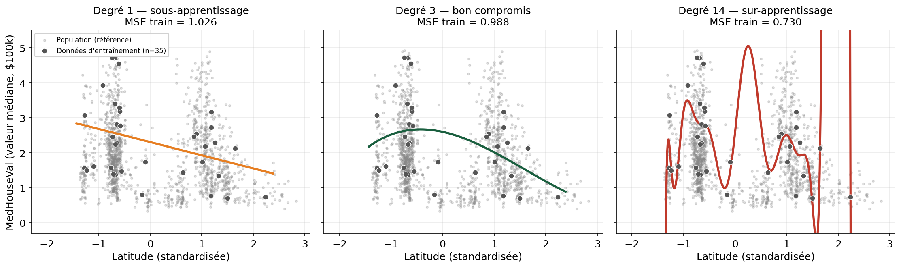

<div class="attention">

**Attention —** Les 3 courbes sont ajustées sur les **mêmes 35 points**. Le degré 14 les traverse presque parfaitement (MSE train le plus bas) mais oscille violemment ailleurs, dès qu'on quitte l'échantillon.

</div>

---

## Sous-apprentissage vs sur-apprentissage : le vocabulaire

| | **Sous-apprentissage** (underfitting) | **Sur-apprentissage** (overfitting) |
|---|---|---|
| Modèle | Trop simple pour le problème | Trop complexe pour les données disponibles |
| Erreur train | Élevée | Très faible |
| Erreur test | Élevée | Élevée (souvent pire !) |
| Cause | **Biais** élevé | **Variance** élevée |
| Exemple ici | Droite (degré 1) sur une relation courbe | Polynôme degré 14 sur 35 points |

<div class="retenir">

**À retenir —** Un bon modèle n'est pas celui qui minimise l'erreur d'entraînement. C'est celui qui minimise l'erreur sur des données **qu'il n'a jamais vues**.

</div>

---

## Mesurer la vraie performance : la courbe de validation

Sur un échantillon plus grand (n=200 train, 4000 test), on trace l'erreur d'entraînement **et** l'erreur de test en fonction de la complexité du modèle :

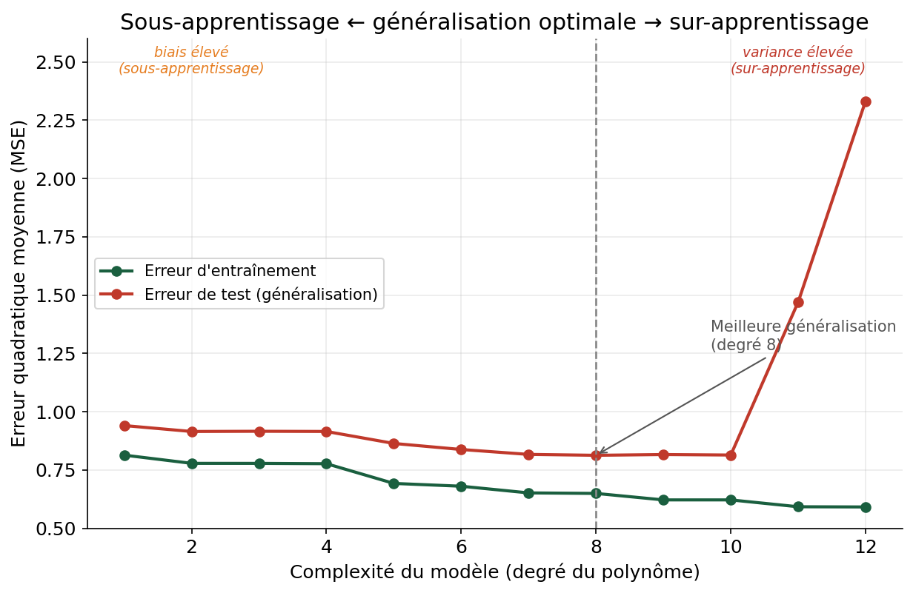

---

## Lecture de la courbe

<div class="intuition">

**Intuition —** L'erreur d'entraînement **décroît toujours** avec la complexité — un modèle plus flexible peut toujours mieux coller aux données qu'il voit. L'erreur de test, elle, **descend puis remonte** : c'est la signature universelle du compromis biais-variance.

</div>

- **Zone de gauche** (degré 1-4) : le modèle est trop rigide → biais élevé → sous-apprentissage
- **Minimum** (degré ≈ 8 ici) : le meilleur compromis pour **cette quantité de données**
- **Zone de droite** (degré > 10) : le modèle épouse le bruit → variance élevée → sur-apprentissage

<div class="exercice">

Cette courbe se redessine différemment selon la taille de l'échantillon d'entraînement. Qu'est-ce que ça implique pour un projet avec **peu** de données ?

</div>

---

<!-- _class: section -->

# Partie A — 2. La décomposition biais-variance

---

## D'où vient vraiment l'erreur de test ?

On veut décomposer mathématiquement l'erreur attendue sur un point $x$. On suppose que la vraie relation est :

$$y = f(x) + \varepsilon, \qquad \mathbb{E}[\varepsilon]=0,\ \text{Var}(\varepsilon)=\sigma^2$$

Le modèle $\hat{y}=\hat{f}(x)$ est entraîné sur un jeu de données $D$ **tiré au hasard** — un autre tirage donnerait un autre $\hat{f}$. On s'intéresse à l'erreur quadratique **moyenne sur tous les tirages possibles de $D$** :

$$\mathbb{E}_D\big[(y-\hat{f}(x))^2\big]$$

<div class="intuition">

**Intuition —** L'astuce de la dérivation : ajouter et retrancher $\mathbb{E}_D[\hat f(x)]$ (la prédiction moyenne, sur tous les jeux d'entraînement possibles) à l'intérieur du carré.

</div>

---

## Dérivation, étape par étape (1/2)

On pose $\bar f(x) = \mathbb{E}_D[\hat f(x)]$. On développe :

$$
\mathbb{E}_D\big[(y-\hat f(x))^2\big]
= \mathbb{E}_D\Big[\big((y - f(x)) + (f(x)-\bar f(x)) + (\bar f(x)-\hat f(x))\big)^2\Big]
$$

En développant le carré, les termes croisés s'annulent (le bruit $\varepsilon=y-f(x)$ est indépendant du modèle, et $\mathbb{E}_D[\bar f(x) - \hat f(x)] = 0$ par définition de $\bar f$). Il reste exactement 3 termes :

$$
\mathbb{E}_D\big[(y-\hat f(x))^2\big] = \underbrace{\sigma^2}_{\text{bruit irréductible}} + \underbrace{\big(f(x)-\bar f(x)\big)^2}_{\text{Biais}^2} + \underbrace{\mathbb{E}_D\big[(\hat f(x) - \bar f(x))^2\big]}_{\text{Variance}}
$$

---

## Dérivation, étape par étape (2/2) — interprétation

$$\text{Erreur attendue} = \underbrace{\sigma^2}_{\text{incompressible}} + \text{Biais}(\hat f(x))^2 + \text{Variance}(\hat f(x))$$

<div class="retenir">

**Biais** = à quel point la prédiction *moyenne* (sur tous les jeux d'entraînement possibles) s'écarte de la vraie fonction. **Variance** = à quel point la prédiction change d'un jeu d'entraînement à l'autre.

</div>

| | Biais | Variance |
|---|---|---|
| Modèle trop simple | Élevé (il ne peut pas capter la vraie forme) | Faible (toujours presque la même droite) |
| Modèle trop complexe | Faible (assez flexible pour tout capter) | Élevée (change radicalement selon l'échantillon) |

$\sigma^2$ ne dépend d'aucun choix de modèle : même le meilleur modèle possible ne peut pas descendre en dessous.

---

## Le visualiser : 40 échantillons différents, même degré

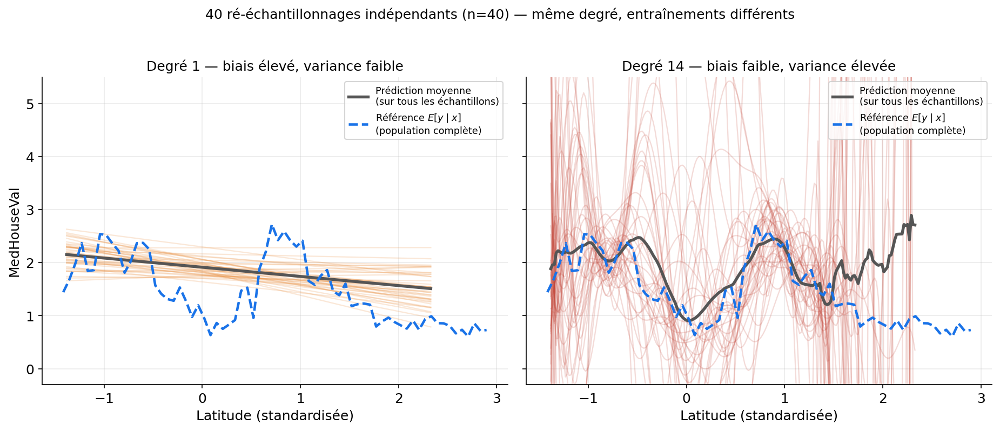

<div class="intuition">

**Intuition —** Degré 1 : droites **presque identiques** entre échantillons (variance faible) mais **loin** de la vraie tendance (biais élevé). Degré 14 : chaque courbe **diffère** (variance élevée) mais leur **moyenne** suit bien la vraie tendance (biais faible).

</div>

---

## La courbe biais-variance en fonction de la complexité

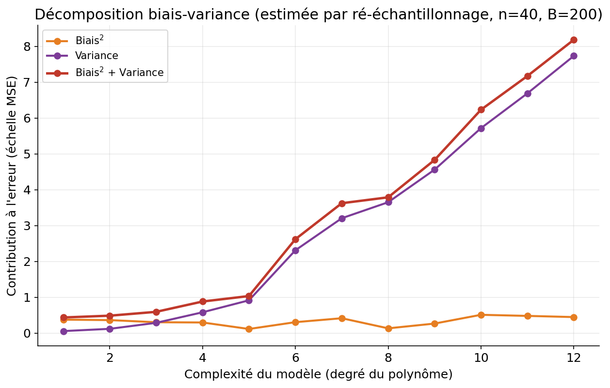

<div class="attention">

**Attention —** Avec peu de données (n=40), la variance explose dès que le modèle se complexifie. <b>La complexité optimale dépend de la quantité de données disponible.</b>

</div>

---

<!-- _class: section -->

# Partie A — 3. Validation croisée

---

## Le problème du split unique

On a appris à séparer train/test. Mais un seul split donne un seul résultat — dépendant du **hasard** de ce découpage précis.

<div class="exercice">

Sur 400 lignes, 30 splits 80/20 (seeds différentes), un Ridge à chaque fois : le MSE de test varie-t-il ?

</div>

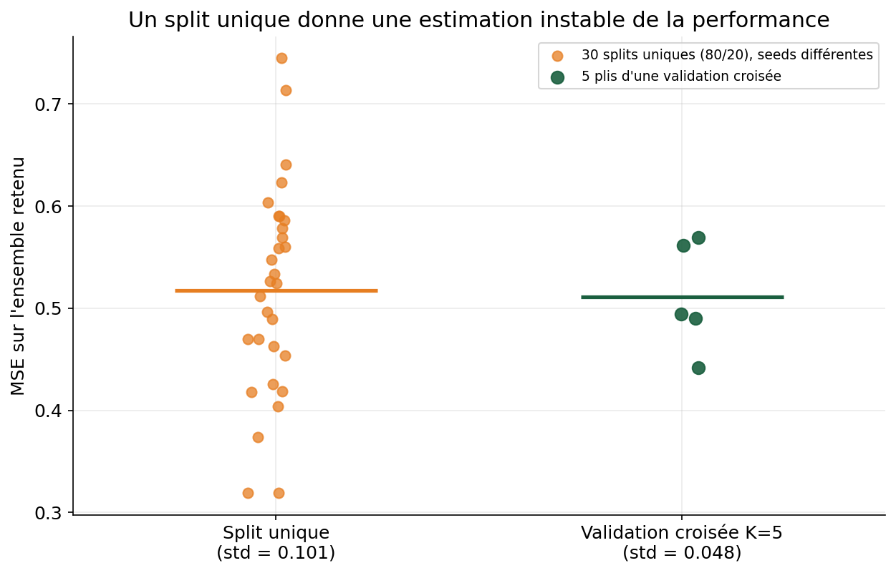

---

## Ce que ça implique

<div class="attention">

**Attention —** Le MSE mesuré varie de <b>0.32 à 0.75</b> selon le split — presque du simple au double ! Si on avait eu la malchance de tomber sur un mauvais split, on aurait pu croire le modèle bien meilleur (ou bien pire) qu'il ne l'est réellement.

</div>

- Publier un seul chiffre de test = publier un résultat **potentiellement non reproductible**
- On a besoin d'une méthode qui **moyenne** l'incertitude du découpage
- Solution : la **validation croisée** (cross-validation)

---

## La validation croisée à K plis (K-fold)

**Principe** : au lieu d'un seul découpage train/validation, on en fait $K$, chacun utilisant une portion différente comme validation.

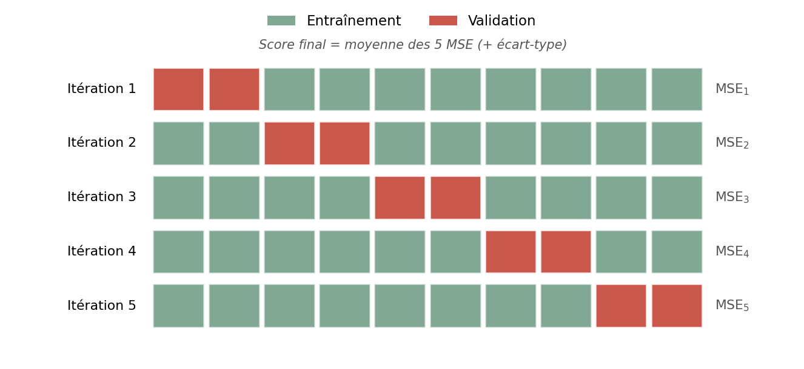

---

## Mécanique du K-fold

1. Mélanger puis découper les données en $K$ blocs de taille égale
2. Pour chaque itération $k = 1 \ldots K$ :
   - entraîner le modèle sur les $K-1$ blocs restants
   - évaluer sur le bloc $k$ → obtenir $\text{MSE}_k$
3. Score final : $\overline{\text{MSE}} = \frac{1}{K}\sum_{k=1}^K \text{MSE}_k$, accompagné de l'**écart-type** entre les plis

<div class="retenir">

**Chaque point sert exactement une fois de validation** et $K-1$ fois d'entraînement. On récupère ainsi $K$ mesures indépendantes de la performance au lieu d'une seule — sur le même dataset que le slide précédent, l'écart-type tombe de 0.101 (splits uniques) à 0.048 (CV) : **deux fois plus stable**.

</div>

$K=5$ ou $K=10$ sont les choix les plus courants (compromis coût de calcul / stabilité de l'estimation).

---

<!-- _class: section -->

# Partie A — 4. La régularisation

---

## Retour au triptyque ①②③

<div class="intuition">

**Intuition —** Jusqu'ici, ① le modèle et ② la fonction de coût étaient fixés une fois pour toutes. La régularisation modifie **les deux à la fois** : elle change la famille de modèles autorisés, en **pénalisant** ceux dont les coefficients sont trop grands, directement dans la fonction de coût.

</div>

**Motivation concrète** : avec des variables corrélées (`AveRooms` et `AveBedrms` corrèlent à 0.85 dans California Housing), les moindres carrés ordinaires (OLS) peuvent produire des coefficients énormes et instables, de signes opposés, qui se compensent artificiellement.

---

## ② Nouvelle fonction de coût : Ridge (pénalité L2)

On ajoute à la MSE une pénalité proportionnelle au **carré** de la norme des poids :

$$J_{\text{Ridge}}(\theta) = \underbrace{\frac{1}{n}\sum_{i=1}^n (y_i - \hat y_i)^2}_{\text{MSE (fidélité aux données)}} + \underbrace{\lambda \sum_{j=1}^p \theta_j^2}_{\text{pénalité L2}}$$

<div class="attention">

**Attention —** Le biais $b$ (l'intercept) n'est **jamais** régularisé — seuls les poids associés aux variables le sont. $\lambda \geq 0$ contrôle l'intensité : $\lambda=0$ redonne exactement l'OLS.

</div>

---

## ③ Dériver la solution : les équations normales régularisées

On reprend exactement la méthode de la séance 2 : annuler le gradient. En notation matricielle, $J_{\text{Ridge}}(\theta) = \frac{1}{n}\|y-X\theta\|^2 + \lambda\|\theta\|^2$.

$$\nabla_\theta J_{\text{Ridge}} = -\frac{2}{n}X^T(y-X\theta) + 2\lambda \theta$$

On annule le gradient :

$$-\frac{1}{n}X^Ty + \frac{1}{n}X^TX\theta + \lambda\theta = 0 \;\Longrightarrow\; \Big(\frac{1}{n}X^TX + \lambda I\Big)\theta = \frac{1}{n}X^Ty$$

$$\boxed{\theta^*_{\text{Ridge}} = \Big(X^TX + n\lambda I\Big)^{-1}X^Ty}$$

---

## Pourquoi cette formule résout le problème de la séance 2

<div class="retenir">

**À retenir —** Rappel séance 2 : $\theta^*_{\text{OLS}} = (X^TX)^{-1}X^Ty$ n'existe pas si $X^TX$ n'est pas inversible (colonnes colinéaires). En ajoutant $n\lambda I$ sur la diagonale, $X^TX + n\lambda I$ devient **toujours inversible** dès que $\lambda>0$ — la régularisation résout aussi un problème numérique, pas seulement statistique.

</div>

- $\lambda \to 0$ : on retrouve exactement $\theta^*_{\text{OLS}}$
- $\lambda \to \infty$ : $\theta^* \to 0$ — le modèle prédit une constante
- Entre les deux : un curseur continu entre flexibilité et stabilité

---

## ② Une autre pénalité : Lasso (L1)

$$J_{\text{Lasso}}(\theta) = \frac{1}{n}\sum_{i=1}^n (y_i-\hat y_i)^2 + \lambda\sum_{j=1}^p |\theta_j|$$

<div class="intuition">

**Intuition —** Une seule lettre change (valeur absolue au lieu de carré) — mais le comportement est radicalement différent : le Lasso peut mettre des coefficients **exactement** à zéro, réalisant une sélection automatique de variables. Le Ridge, lui, ne les amène jamais exactement à zéro.

</div>

Contrairement à Ridge, $J_{\text{Lasso}}$ n'est pas différentiable en $\theta_j=0$ : pas de formule fermée, on résout par optimisation itérative (coordinate descent).

---

## Pourquoi cette différence ? L'intuition géométrique

Minimiser $J(\theta)$ sous une contrainte de budget ($\sum\theta_j^2\leq t$ ou $\sum|\theta_j|\leq t$) revient à trouver où les courbes de niveau du coût **touchent en premier** la région autorisée.

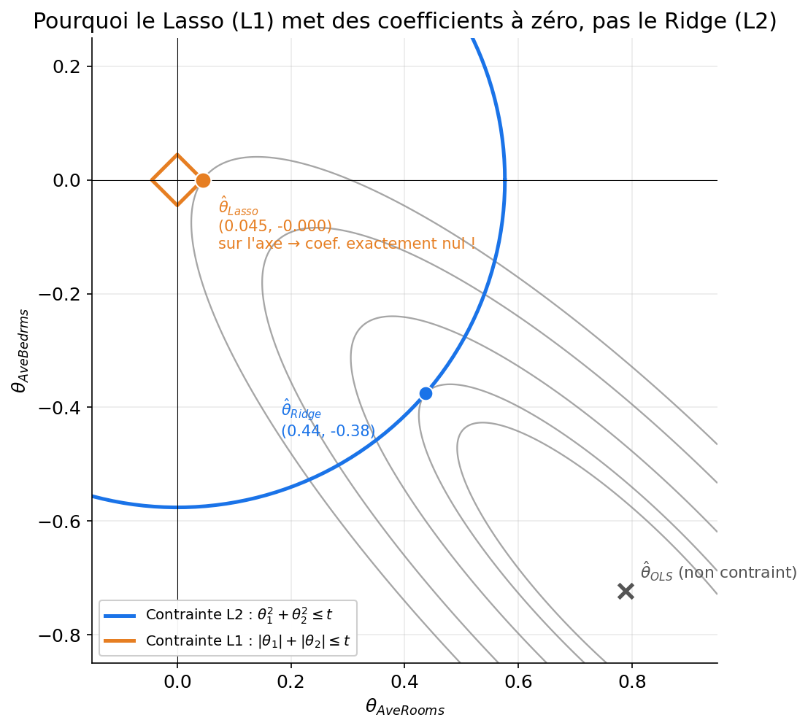

---

## Lecture de la figure

<div class="retenir">

**À retenir —** Le losange L1 a des **coins** situés exactement sur les axes. Avec des courbes de niveau elliptiques (variables corrélées), le point de contact tombe très souvent sur un coin → **un coefficient exactement nul**. Le cercle L2 n'a pas de coin : le point de contact est presque toujours à l'intérieur d'un quadrant → coefficients réduits mais rarement nuls.

</div>

- Ici $\hat\theta_{\text{Lasso}} = (0.045,\ 0)$ : `AveBedrms` est **totalement éliminée**
- $\hat\theta_{\text{Ridge}} = (0.44,\ -0.38)$ : les deux variables restent, mais très réduites par rapport à l'OLS $(0.79, -0.72)$

---

## Chemins de régularisation — Ridge

En faisant varier $\lambda$ sur toutes les variables de California Housing, on observe une **décroissance continue** de chaque coefficient :

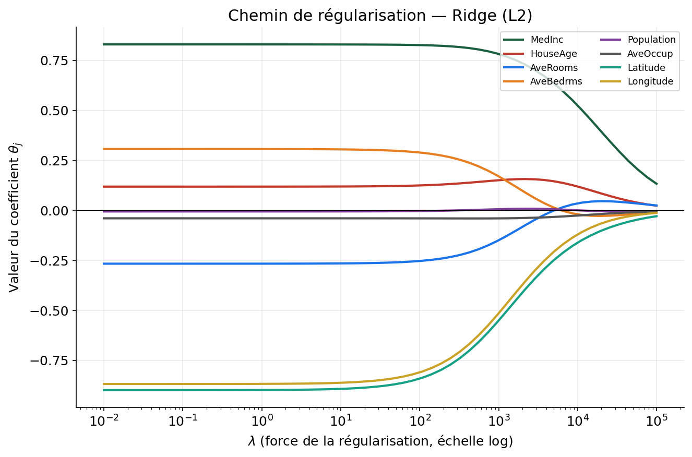

---

## Chemins de régularisation — Lasso

Le même exercice avec Lasso : les coefficients s'annulent **un à un**, dans un ordre qui reflète leur importance relative :

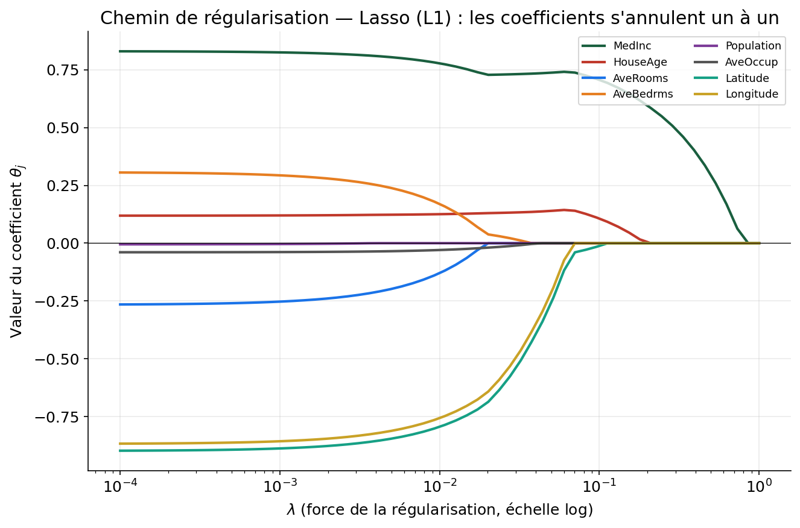

<div class="exercice">

Quelle variable le Lasso élimine-t-il en dernier ? Est-ce cohérent avec ce qu'on sait du prix de l'immobilier californien ?

</div>

---

<!-- _class: section -->

# Partie A — 5. Choisir λ et sélectionner un modèle

---

## ③ L'optimisation devient à deux niveaux

<div class="intuition">

**Intuition —** Avant, "optimiser" voulait dire : trouver $\theta$ qui minimise $J(\theta)$ pour un $\lambda$ donné. Maintenant il faut **aussi** choisir $\lambda$ lui-même. On ne peut pas choisir $\lambda$ en minimisant l'erreur d'entraînement (ça donnerait toujours $\lambda=0$) — il faut le choisir par **validation croisée**.

</div>

**Recette** :
1. Pour chaque valeur candidate de $\lambda$ dans une grille
2. Faire une validation croisée complète (K plis)
3. Retenir le $\lambda$ qui minimise l'erreur moyenne de validation

---

## Trouver le bon λ : trop faible, trop fort

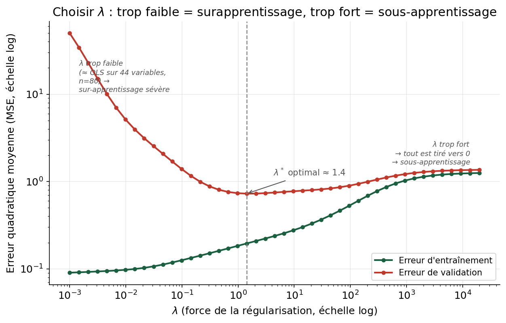

<div class="attention">

**Attention —** Pour bien montrer cet effet, on a volontairement pris peu de données (n=80) et beaucoup de variables (44, avec interactions) : dans ce régime, un $\lambda$ trop faible surapprend violemment (MSE test explose), un $\lambda$ trop fort sous-apprend. Entre les deux, un minimum net.

</div>

---

## En pratique : `GridSearchCV`

```python
from sklearn.linear_model import Ridge
from sklearn.model_selection import GridSearchCV

param_grid = {"alpha": [0.01, 0.1, 1, 10, 100, 1000]}
grid = GridSearchCV(Ridge(), param_grid, cv=5,
                     scoring="neg_mean_squared_error")
grid.fit(X_train, y_train)

print(grid.best_params_)   # le meilleur lambda trouvé
print(-grid.best_score_)   # le MSE moyen associé (CV)
```

`GridSearchCV` automatise exactement la recette du slide précédent : grille de valeurs × validation croisée × sélection du meilleur score — le même principe pour n'importe quel hyperparamètre.

---

## Sélection de modèle : la hiérarchie à respecter

<div class="attention">

**Attention —** Piège classique : utiliser le jeu de <b>test</b> pour choisir $\lambda$. Le jeu de test devient alors implicitement partie de l'entraînement — le score qu'il donne n'est plus une estimation honnête de la généralisation.

</div>

| Ensemble | Rôle | Utilisé pour |
|---|---|---|
| **Train** | Ajuster $\theta$ | L'apprentissage direct |
| **Validation** (ou CV) | Choisir les hyperparamètres ($\lambda$, degré, etc.) | La comparaison de modèles |
| **Test** | Estimer la performance finale | Une seule fois, à la toute fin |

---

<!-- _class: section -->

# Partie B — 6. Prétraitement : le vrai visage des données

---

## Retour à Titanic : ce que les données ont de sale

<div class="intuition">

**Intuition —** Jusqu'ici, on a travaillé sur des données déjà propres. En réalité, la majorité du temps d'un projet ML se passe **avant** le modèle : nettoyer, encoder, transformer.

</div>

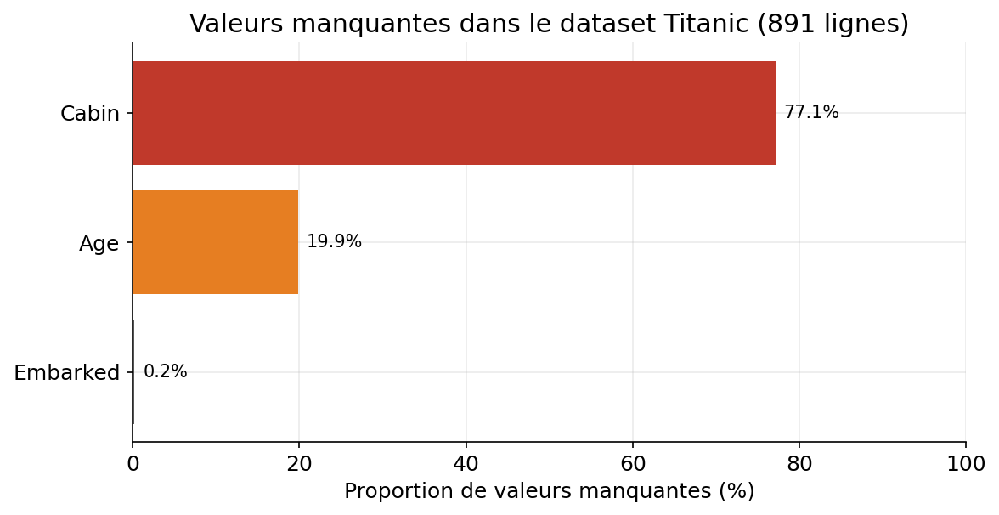

`Cabin` est manquante à 77% (probablement pas exploitable telle quelle), `Age` à 20% (trop pour être ignorée), `Embarked` à 0.2% (négligeable).

---

## Valeurs manquantes : que faire ?

| Stratégie | Description | Risque |
|---|---|---|
| **Suppression** de la ligne | On jette les lignes incomplètes | Perte de données, biais si le manque n'est pas aléatoire |
| **Suppression** de la colonne | On jette toute la variable | Perte d'information potentiellement utile |
| **Imputation simple** | Moyenne / médiane / mode | Réduit artificiellement la variance |
| **Imputation par modèle** | Prédire la valeur manquante à partir des autres variables | Plus coûteux, risque de fuite si mal fait |

<div class="retenir">

**À retenir —** Pour `Age` (numérique, distribution asymétrique) → **médiane**. Pour `Embarked` (catégorielle, 2 valeurs manquantes) → **mode**. Ces choix s'apprennent avec `SimpleImputer`.

</div>

---

## Encoder les variables catégorielles

Un modèle ne comprend que des nombres. `Sex` (`male`/`female`), `Embarked` (`S`/`C`/`Q`) doivent être transformées.

<div class="attention">

**Attention —** Tentation naturelle : `S→0, C→1, Q→2` (encodage ordinal). Problème : cela affirme implicitement que $Q > C > S$ numériquement, une relation d'ordre <b>qui n'existe pas</b> pour un port d'embarquement.

</div>

**One-Hot Encoding** — une colonne binaire par catégorie :

| Embarked | is_S | is_C | is_Q |
|---|---|---|---|
| S | 1 | 0 | 0 |
| C | 0 | 1 | 0 |

Aucune relation d'ordre n'est introduite ; chaque colonne est indépendante.

**Nuance** : l'encodage ordinal reste légitime quand la variable a un **vrai ordre naturel** — `Pclass` (1ʳᵉ, 2ᵉ, 3ᵉ classe) a un ordre socio-économique réel, contrairement à `Embarked`. À évaluer variable par variable.

```python
from sklearn.preprocessing import OneHotEncoder

encoder = OneHotEncoder(sparse_output=False, handle_unknown="ignore")
embarked_encoded = encoder.fit_transform(df[["Embarked"]])
```

---

<!-- _class: section -->

# Partie B — 7. Mise à l'échelle (scaling)

---

## Pourquoi les échelles comptent : `Age` vs `Fare`

Dans Titanic, `Age` va de 0 à 80, `Fare` de 0 à 512 — deux ordres de grandeur différents.

<div class="intuition">

**Intuition —** On a vu en séance 2 que la descente de gradient suit les courbes de niveau du coût. Si les variables ont des échelles très différentes, ces courbes de niveau sont des <b>ellipses très allongées</b> plutôt que des cercles — et la descente de gradient zigzague au lieu d'aller droit au but.

</div>

---

## Le voir sur les vraies courbes de niveau du coût

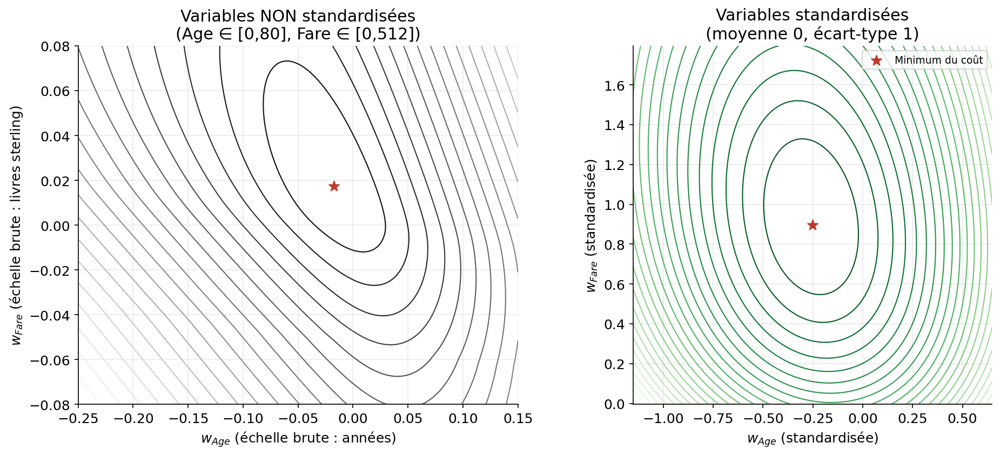

<div class="attention">

**Attention —** À gauche (bruts) : ellipses allongées → convergence lente. À droite (standardisées) : contours quasi circulaires → convergence rapide et directe.

</div>

---

## Un deuxième effet, moins connu : l'injustice de la régularisation

<div class="attention">

**Attention —** La pénalité de régularisation ($\lambda\sum\theta_j^2$ ou $\lambda\sum|\theta_j|$) porte sur la valeur numérique de $\theta_j$ — **pas** sur l'importance réelle de la variable. Une variable à grande échelle a naturellement un petit coefficient optimal, donc elle est <b>protégée</b> de la pénalité, indépendamment de sa pertinence.

</div>

**Preuve par l'absurde** : on duplique `Fare` en deux colonnes portant *exactement* la même information — `Fare` (0–512) et `Fare/100` (0–5.12) — puis on régularise (Ridge, même $\lambda$) sans, puis avec standardisation.

---

## Démonstration numérique

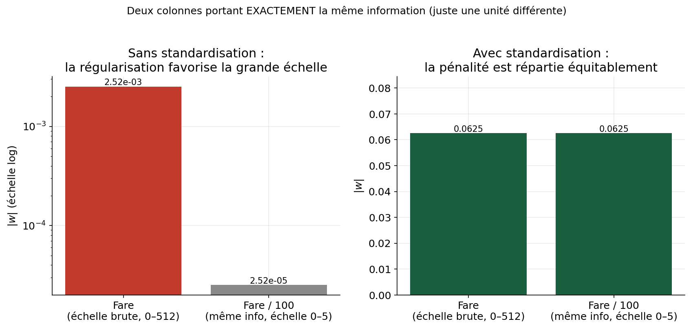

<div class="retenir">

**À retenir —** Sans standardisation, `Fare` absorbe presque tout le poids — un pur artefact d'unité. Après standardisation, la pénalité est répartie **équitablement**.

</div>

**Conclusion : standardiser n'est pas optionnel dès qu'on régularise.**

---

## `StandardScaler` vs `MinMaxScaler`

| | `StandardScaler` | `MinMaxScaler` |
|---|---|---|
| Formule | $\dfrac{x-\mu}{\sigma}$ | $\dfrac{x-x_{min}}{x_{max}-x_{min}}$ |
| Résultat | moyenne 0, écart-type 1 | valeurs dans $[0,1]$ |
| Sensibilité aux outliers | modérée | forte (un seul outlier écrase l'échelle) |
| Usage typique | régression, régularisation, descente de gradient | réseaux de neurones, images |

<div class="exercice">

`Fare` contient des valeurs extrêmes (jusqu'à 512, alors que la médiane est à 14). Quel scaler choisiriez-vous, et pourquoi ?

</div>

---

<!-- _class: section -->

# Partie B — 8. La fuite de données (data leakage)

---

## Le piège le plus silencieux du Machine Learning

<div class="attention">

**Attention —** La fuite de données (<i>data leakage</i>) survient quand une information sur les données de <b>test/validation</b> s'infiltre, même indirectement, dans le processus d'entraînement. Le symptôme est trompeur : le modèle semble <b>excellent</b> en interne, puis s'effondre en production.

</div>

**Sources classiques de fuite :**
- Ajuster un `Scaler` ou un `Imputer` sur **toutes** les données avant de séparer train/test
- Encoder une variable catégorielle avec des statistiques calculées sur tout le dataset
- Sélectionner des variables en regardant leur lien avec la cible sur tout le dataset

---

## Démonstration : encoder `Ticket` avec fuite

`Ticket` a 681 valeurs uniques pour 891 lignes — beaucoup de tickets n'apparaissent qu'une ou deux fois. On l'encode par la moyenne de `Survived` par valeur de ticket :

- **Avec fuite** : la moyenne est calculée sur **tout** le dataset (train + test), avant la validation croisée
- **Sans fuite** : la moyenne est calculée **uniquement** sur le pli d'entraînement à chaque itération de la CV

<div class="intuition">

**Intuition —** Si un ticket n'apparaît qu'une fois, sa "moyenne" calculée sur tout le dataset... c'est littéralement sa propre étiquette `Survived`. Le modèle triche sans qu'on s'en rende compte.

</div>

---

## Résultat, en chiffres réels

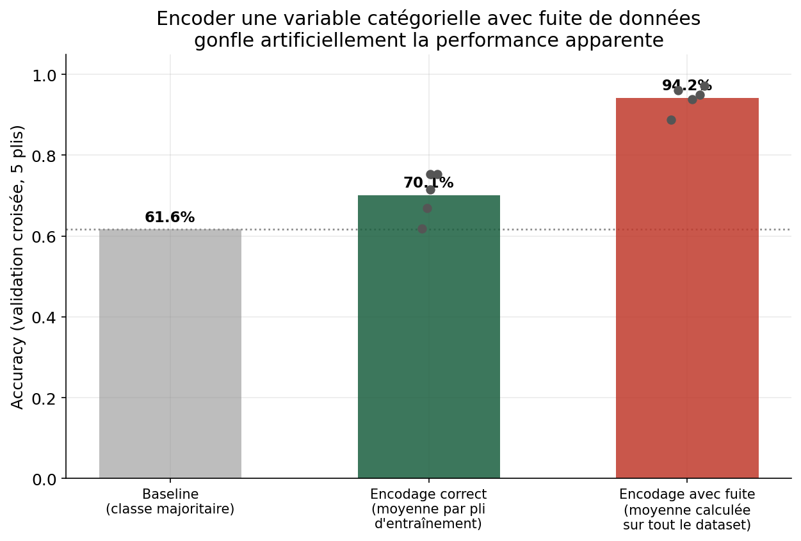

<div class="retenir">

**À retenir —** 94.2% semble spectaculaire — c'est un mirage causé par la fuite. La version correcte (70.1%) est modeste mais honnête, et **c'est la seule qui se généraliserait en production**.

</div>

---

## La règle d'or contre la fuite

<div class="retenir">

**Toute transformation qui "apprend" quelque chose des données (une moyenne, un écart-type, une médiane, une fréquence...) doit être ajustée UNIQUEMENT sur les données d'entraînement — jamais sur la validation ni le test.** Et cela doit être refait à **chaque pli** de la validation croisée, pas une seule fois avant.

</div>

C'est justement pour appliquer cette règle de façon systématique et sans erreur manuelle que scikit-learn propose l'objet **`Pipeline`**.

---

<!-- _class: section -->

# Partie B — 9. Les Pipelines scikit-learn

---

## Un seul objet pour tout enchaîner

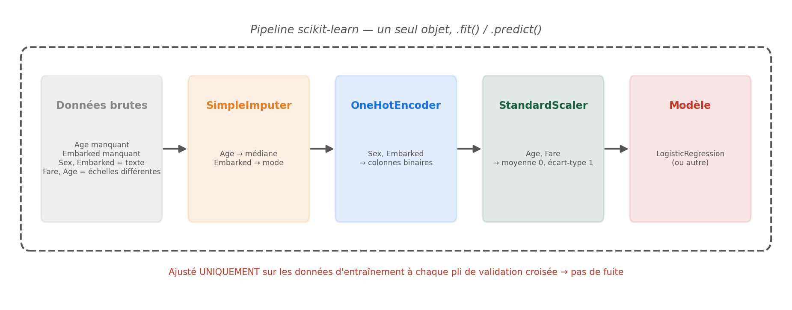

<div class="intuition">

**Intuition —** Un `Pipeline` regroupe transformations + modèle dans un **seul objet** (`.fit()` / `.predict()`). En validation croisée, chaque étape est réajustée **séparément à chaque pli** — la fuite devient structurellement impossible.

</div>

---

## Un sous-pipeline pour les variables numériques

`Age` et `Fare` : imputer la médiane, puis standardiser.

```python
from sklearn.pipeline import Pipeline
from sklearn.impute import SimpleImputer
from sklearn.preprocessing import StandardScaler

num_pipeline = Pipeline([
    ("imputer", SimpleImputer(strategy="median")),
    ("scaler", StandardScaler())
])
```

<div class="intuition">

**Intuition —** Toujours le même ordre : combler les trous **avant** de transformer l'échelle.

</div>

---

## Un sous-pipeline pour les variables catégorielles

`Sex` et `Embarked` : imputer le mode, puis encoder en One-Hot.

```python
from sklearn.preprocessing import OneHotEncoder

cat_pipeline = Pipeline([
    ("imputer", SimpleImputer(strategy="most_frequent")),
    ("encoder", OneHotEncoder(handle_unknown="ignore"))
])
```

Deux groupes de variables, deux traitements différents, deux sous-pipelines — il reste à les recombiner en un seul objet.

---

## Les recombiner avec `ColumnTransformer`

```python
from sklearn.compose import ColumnTransformer

num_features = ["Age", "Fare"]
cat_features = ["Sex", "Embarked"]

preprocessor = ColumnTransformer([
    ("num", num_pipeline, num_features),
    ("cat", cat_pipeline, cat_features),
])
```

<div class="retenir">

**À retenir —** `ColumnTransformer` applique **le bon sous-pipeline à chaque colonne**, puis recolle tout en une seule matrice.

</div>

---

## Assembler et valider le Pipeline complet

```python
from sklearn.linear_model import LogisticRegression
from sklearn.model_selection import cross_val_score

model = Pipeline([
    ("preprocessing", preprocessor),
    ("classifier", LogisticRegression())
])

scores = cross_val_score(model, X, y, cv=5, scoring="accuracy")
print(scores.mean(), scores.std())
```

`model.fit(X_train, y_train)` puis `model.predict(X_test)` : une seule ligne chacune pour entraîner ou prédire **tout** le flux, du brut à la prédiction.

---

## Pourquoi c'est la bonne pratique

<div class="retenir">

**À retenir —** `cross_val_score(model, ...)` réajuste **tout le pipeline** (imputation, encodage, scaling, modèle) séparément à chaque pli de la validation croisée. C'est la façon canonique d'éviter toute fuite de données sans y penser manuellement à chaque étape.

</div>

- Une seule interface (`.fit()`, `.predict()`) pour tout le flux, du brut à la prédiction
- Compatible avec `GridSearchCV` : on peut régler les hyperparamètres du modèle **et** du prétraitement ensemble
- Le même `Pipeline` s'utilise en entraînement, en validation, et en production — aucun risque d'oubli

---

<!-- _class: section -->

# Synthèse

---

## Le triptyque ①②③, version augmentée

| Brique | Séances 2-3 | Séance 4 |
|---|---|---|
| ① Modèle | Droite, sigmoïde | + un curseur de **complexité** à régler (degré, nb variables) |
| ② Coût | MSE, log-loss | + un terme de **pénalité** (Ridge/Lasso) |
| ③ Optimisation | Descente de gradient | + un **second niveau** : choisir les hyperparamètres par validation croisée |

<div class="retenir">

**À retenir —** Et **avant** même d'arriver à ①, il y a désormais une étape 0 : préparer les données (valeurs manquantes, encodage, échelle) — dans un `Pipeline`, pour ne jamais laisser fuiter d'information du test vers l'entraînement.

</div>

---

## Ce qu'il faut retenir de cette séance

1. L'erreur d'entraînement ment ; seule l'erreur de **généralisation** compte
2. Erreur = biais² + variance + bruit irréductible — un compromis, pas un problème à annuler
3. La validation croisée donne une estimation **stable** de la performance
4. Ridge (L2) réduit en douceur ; Lasso (L1) peut éliminer des variables
5. Les hyperparamètres se choisissent par CV — **jamais** sur le jeu de test
6. Standardiser n'est pas cosmétique : ça change la convergence **et** l'équité de la régularisation
7. La fuite de données peut faire croire à un excellent modèle qui n'existe pas
8. Un `Pipeline` rend toute cette discipline automatique

---

## TP guidé

**Objectif** : sur Titanic, construire un `Pipeline` complet (imputation + encodage + scaling + `LogisticRegression`), le comparer à un `Pipeline` équivalent avec Ridge/Lasso appliqué à une régression sur `Fare`, et sélectionner un hyperparamètre par `GridSearchCV`.

1. Explorer les valeurs manquantes et choisir une stratégie d'imputation justifiée
2. Construire le `ColumnTransformer` (numérique / catégoriel)
3. Évaluer par validation croisée à 5 plis (accuracy + écart-type)
4. Chercher le meilleur $\lambda$ avec `GridSearchCV`
5. **Bonus** : mesurer l'impact d'une fuite volontaire (scaler ajusté hors Pipeline) sur le score affiché

---

<!-- _class: section -->

# Questions ?

---

<!-- _class: titre -->

## Prochaine séance

### Modèles à base d'arbres & réduction de dimension

<br>

Arbres de décision, forêts aléatoires, et une première méthode de réduction de dimension (PCA) — toujours sur California Housing et Titanic.
